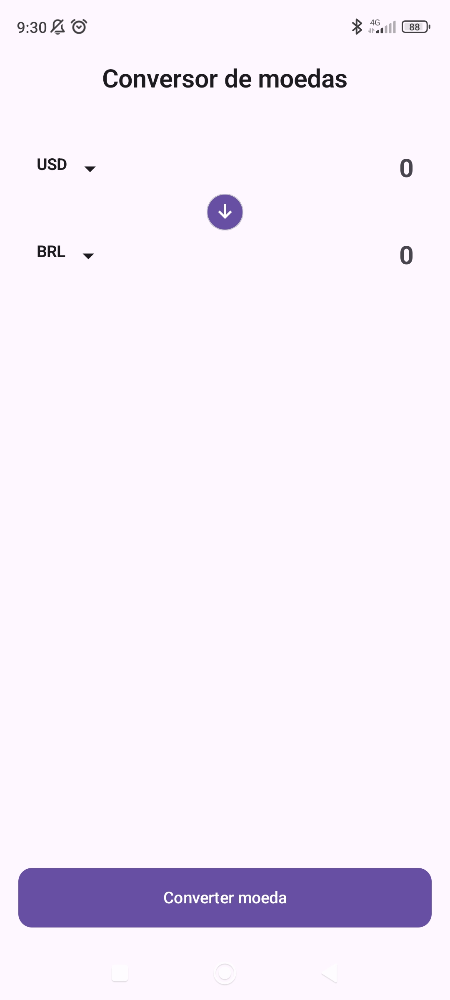
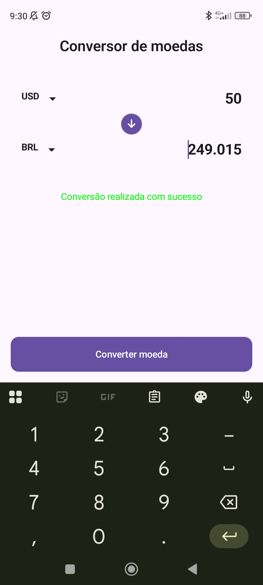

# 💱 Currency Converter App

## 📱 About
This Android application allows users to convert currencies in real time using an external API.

The project was built as part of my learning journey in Android development, focusing on applying clean architecture principles and modern development tools.

---

## 🏗️ Architecture
- MVVM (Model-View-ViewModel)
- Clean Architecture (Data, Domain, Presentation)

The project is structured to ensure separation of concerns, scalability and maintainability.

---

## 🛠️ Tech Stack
- Kotlin
- Jetpack Compose
- Hilt (Dependency Injection)
- Ktor (HTTP Client)
- ViewModel
- UI State

---

## ✨ Features
- Real-time currency conversion
- API integration using Ktor
- State management with UI State
- Modular and scalable architecture

---

## 📸 Screenshots

  
  

---

## 🧠 What I Learned
- Structuring Android apps using Clean Architecture
- Managing UI state with ViewModel
- Consuming APIs with Ktor
- Implementing dependency injection with Hilt

---

## 🚀 Future Improvements
- Improve UI/UX design
- Add error handling and loading states
- Implement unit tests
